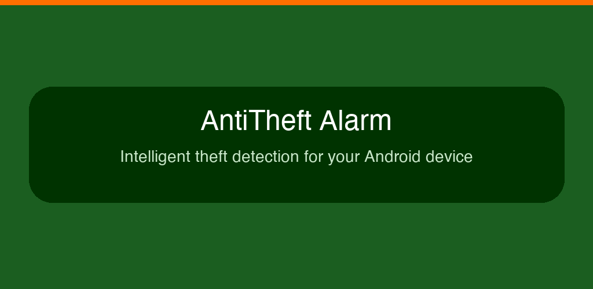
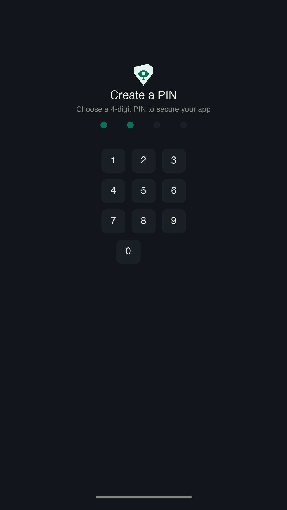
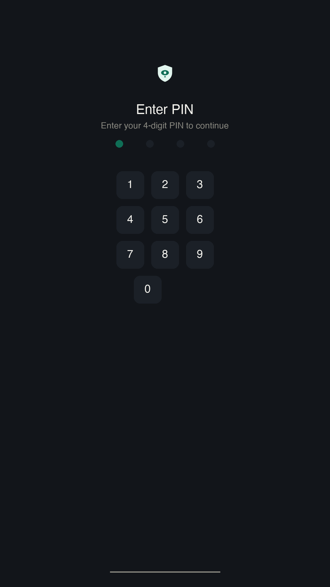
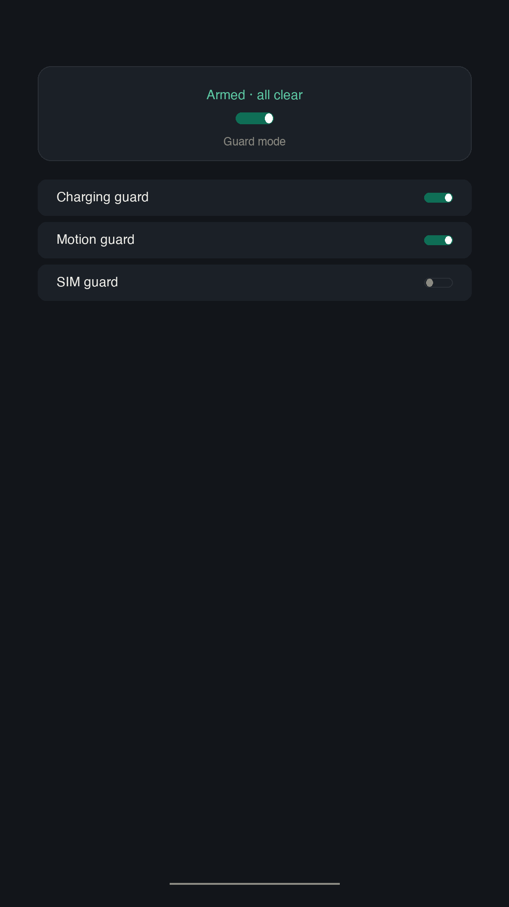

# AntiTheft Alarm

<p align="center">
  
</p>

<p align="center">
  
</p>

Intelligent theft alarm that protects your phone when charging or unattended. Designed for phones left in public places — cafes, airports, libraries, and shared workspaces.

**Package:** `com.shreyash.antitheft` · **v1.0.1**

<p align="center">
  <a href="https://play.google.com/store/apps/details?id=com.shreyash.antitheft">
    
  </a>
</p>

## Tech Stack

Kotlin · Jetpack Compose (Material 3) · Compose Navigation · Coroutines + Flow · EncryptedSharedPreferences · Foreground Service · WorkManager · SensorManager · DevicePolicyManager

## Features

| Feature | Description |
|---------|-------------|
| **App PIN** | First-run PIN setup, PIN gate on settings/disarm, app-level only (no device unlock dependency) |
| **Charging Guard** | Alarm triggers instantly if power is disconnected while armed |
| **Motion Guard** | Accelerometer-based movement detection with Low/Med/High sensitivity |
| **SIM Guard** | Detects SIM card removal or swap, alerts trusted contact |
| **Intruder Selfie** | Front camera captures photo after 3 failed PIN attempts |
| **Geofence Guard** | GPS radius or trusted Wi-Fi SSID safe zone |
| **Anti-disable** | Device Admin API protection, force-stop/uninstall detection |
| **Trusted Contacts** | SMS/email alerts to configured contacts on trigger events |
| **Event History** | Chronological log of all alarm events with timestamps and details |

## Screens

| PIN Setup | PIN Entry | Home (Armed) |
|-----------|-----------|-------------|
|  |  |  |

## Key Features

- **No account required** — everything stays on your device
- **No ads, no tracking, no network calls** — open source and privacy-first
- **Alarm at max volume** — overrides silent/DND, works screen-off
- **Grace period** — short delay on arming + disarm window after trigger
- **Per-feature toggles** — each guard feature individually switchable in Settings
- **Foreground service** — persistent notification keeps detection alive (Android 8+)
- **Reboot recovery** — `BOOT_COMPLETED` receiver restarts detection automatically

## Privacy Policy

This app does **not collect, store, or transmit any personal data**. All data (PIN, settings, event history, intruder photos) is stored locally on your device using encrypted storage.

Privacy Policy: [shreyashp47.github.io/Anti-Theft-Alarm-App/privacy_policy.html](https://shreyashp47.github.io/Anti-Theft-Alarm-App/privacy_policy.html)

## Open Testing

This app is in open testing on Google Play. To help me get it to production:

1. **Join the tester group:** [Google Groups](https://groups.google.com/g/antitheft-alarm-testers)
2. **Install the app:** Once approved, install from the [Play Store listing](https://play.google.com/store/apps/details?id=com.shreyash.antitheft)
3. **Report issues:** Open a [GitHub issue](https://github.com/shreyashp47/Anti-Theft-Alarm-App/issues)

Your feedback helps shape the production release!

## Build

```bash
./gradlew assembleDebug
```

Or open in Android Studio and run on a device/emulator.

> **Note:** Requires JDK 17+. Set `JAVA_HOME` to Android Studio's bundled JDK:
> ```bash
> export JAVA_HOME="/Applications/Android Studio.app/Contents/jbr/Contents/Home"
> ```
